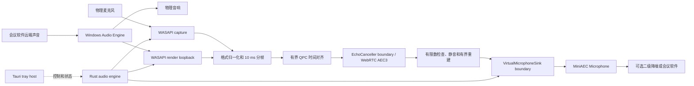

# MiniAEC 技术方案

状态：M1 虚拟麦克风数据通路、M2 实时 bypass 与 M3 实时默认 AEC3 已通过各自的开发期 elevated 功能验收。M3 的合成自动化与单独批准的真机测试覆盖 Windows Recorder、Discord、较大音量 far-end 抑制、near-end-only、double-talk、render silence/recovery、sender contention、stop/start 和完整 rollback。Double-talk 可懂但存在明显近端吞字，作为冻结默认算法的已知质量限制保留，当前不调参；普通用户权限、正式安装签名、长期漂移与算法质量优化仍属于后续里程碑，因此项目尚不是可分发的普通用户产品

目标平台：Windows 11 x64

应用技术栈：Rust + Tauri 2（无窗口托盘）+ WASAPI + WebRTC AEC3

驱动技术栈：Windows WDK / SysVAD 派生驱动

## 1. 产品边界

MiniAEC 只解决外放场景的声学回声：实际送往物理音响的声音经过房间和设备再次进入物理麦克风，会议对方因此听见自己的声音。

产品输入与输出固定为：

```text
物理麦克风 + 物理播放设备 loopback -> AEC -> MiniAEC Microphone
```

用户可以把 `MiniAEC Microphone` 继续交给 NVIDIA Broadcast、会议软件自带降噪或其他二级处理器。MiniAEC 本身不实现：

- 噪声抑制（NS）；
- 自动增益（AGC）；
- EQ、去混响或音色增强；
- 神经网络语音增强；
- macOS、Linux 或移动端支持；
- 设置窗口或 Web 前端。

第一个可用版本必须自带 `MiniAEC Microphone`。只有托盘壳、离线 WAV 输出或依赖第三方虚拟线缆都不能算可用版本。

## 2. 总体架构



### 2.1 Tauri 托盘宿主

Tauri 只负责进程生命周期和低频控制面。M3 当前实现包含：

- 当前状态；
- AEC 启用或显式旁路；
- 重启音频引擎；
- 从 `MINI_AEC_MICROPHONE_ID` 和 `MINI_AEC_RENDER_ID` 读取精确的开发期 endpoint ID；
- 退出。

物理设备选择界面、设置持久化、默认设备自动跟随、开机启动和打开日志目录不属于 M3。不创建 WebView 或主窗口。Tauri runtime 不处理 PCM，托盘销毁也不能意外穿透实时线程边界。

### 2.2 Rust 音频引擎

`crates/mini-aec-engine/` 负责双输入设备生命周期、预分配缓冲、格式转换、10 ms 调度、有界 QPC 同步、默认 AEC、虚拟麦克风输出和故障状态。它能脱离 Tauri 运行合成测试。

已建立的核心边界包括：

- `AudioInput` / `AudioInputFactory`：承载显式选择且角色校验的物理 microphone capture 与 physical render loopback，Windows 类型不泄漏；
- `EchoCanceller` / `EchoCancellerFactory`：定义 render-first 处理、capture 输出与 adapter 重建，WebRTC 类型只存在于默认 M131 adapter；
- `VirtualMicrophoneSink`：向驱动提交处理后 PCM；
- `Engine` / `EngineSnapshot`：非实时控制、只读状态、同步/AEC/队列/处理时延/故障诊断。

M3 的处理 worker 独占同步器、`EchoCanceller` 和一次 sink session；两个输入 worker 分别在自己的线程创建、使用、停止并销毁 COM/WASAPI 对象。三个 worker 使用有限等待和有界队列，停止或显式 restart 会 join 全部 worker、清空 PCM 和同步/AEC 状态，并从协议 sequence 零开始新 session。

WebRTC、WASAPI、Tauri 和驱动通信类型不能泄漏到这些项目级合同之外。

M2 的实时 bypass 合同固定为：

- 配置必须提供精确的物理 capture endpoint ID；名称只用于诊断，不能自动跟随默认设备，也不能把 `MiniAEC Microphone` 选为自身输入；
- 一个 capture worker 在自身线程创建、使用并销毁 WASAPI/COM 对象，一个 sink worker 独占一次 `VirtualMicrophoneSink` session；实时 worker 不写文件、不打印、不等待 Tauri 或 async runtime；
- WASAPI 使用 event-driven shared mode 和 Windows Audio Engine conversion 请求 48 kHz、单声道 `f32`，随后清理非有限数、限制范围并组装严格的 480-sample 帧；
- capture 到 sink 之间只有四个完整帧的同步 latest-wins ring；满时丢弃最旧未读帧，协议 sequence 在 dequeue 时从零分配，因此本地丢帧不会制造协议序号缺口；
- 生命周期为 `Stopped → Starting → RunningBypass → Stopping → Stopped`，source invalidation、不可恢复 capture 错误、driver absence、access denial、sender contention、version mismatch 或 rejected write 会终止当前 run、清空 PCM 并进入 `Failed`，只能显式 restart；
- snapshot 只包含 endpoint、run/session identity、packet/frame、silence、discontinuity、timestamp、queue、sink 和 error 元数据，不包含 PCM 或会议内容。

M2 验收所用的历史开发包只允许 SYSTEM 和 Administrators，因此当时的 headless bypass 真机测试是 elevated 路径。后续 change `enable-normal-user-virtual-microphone-access` 已加入受保护的 Interactive Users 最小读写 DACL、明确 busy 仲裁和非提升验证工具，并通过批准后的新包安装、普通用户端到端消费、owner 退出/重连与完整 rollback。显式 bypass 是独立模式，不是 AEC 故障时静默泄漏原始麦克风的回退策略。

M3 实时 AEC 合同固定为：

- 配置必须同时提供精确的物理 capture endpoint ID 与物理 render endpoint ID；角色不符、inactive、不可访问或不存在均失败，不回退到默认设备；
- microphone 与 render 各使用八帧 latest-wins 同步队列；以 microphone 为处理节拍，在统一 QPC 时间线上按 5 ms 容差配对，记录 stale、silent-reference、overflow、discard、discontinuity 与 timestamp error；
- 单帧绝对偏差超过 100 ms 时 reference 视为不可用；带 render 时间戳但连续 50 个 capture 帧仍无法配对时终止当前 run。物理播放完全静音时，active loopback endpoint 合法地可能不产生 packet，此时持续使用计数静音参考并保持可见 `Degraded`，不能仅因没有 render timestamp 终止或切换 bypass；恢复十个连续健康配对帧后才回到 `RunningAec`；
- discontinuity 或 timestamp error 清空受影响的部分帧并建立新同步 epoch，同时重建 AEC；无效 AEC 输出当前帧静音并有界重建，连续三次处理失败后终止；
- 生命周期包含 `RunningAec` 与 `Degraded`，任何 AEC、同步、输入或 sink 的终止错误都进入 `Failed`，不会自动切换到 `RunningBypass`；
- 处理耗时以固定桶记录 P50/P95/P99/maximum，10 ms deadline miss 与全部诊断写盘都不阻塞实时 worker。

### 2.3 Windows 音频适配

使用 WASAPI 直接访问物理 capture、render loopback、事件驱动缓冲、设备位置和 QPC 时间戳。不能用跨平台抽象隐藏 Windows 的 loopback、设备通知或时序信息。

### 2.4 AEC 适配

当前基线为 `webrtc-audio-processing 2.1.0` 和 FreeDesktop M131 源码。实时 adapter 使用 `Processor::new(48_000)`，只启用完整 AEC，使用 AEC3 上游默认参数；stream delay 不设置，NS、AGC、实验配置和后处理关闭。每个匹配的 render frame 先于 capture frame 提交，adapter 自有并复用通道缓冲，输出必须为有限值。

依赖来源和本地构建修改以 [`vendor/UPSTREAM.md`](../vendor/UPSTREAM.md) 为准。升级必须遵循 [`upstream-upgrade-plan.md`](upstream-upgrade-plan.md)。

### 2.5 虚拟麦克风驱动

驱动基于固定版本的 Microsoft SysVAD，使用 WDK 所需的 C/C++。公共 capture endpoint 名称固定为 `MiniAEC Microphone`。

当前验证实现使用受限控制设备加驱动自有有界环形缓冲。源码中的受保护 DACL 为 SYSTEM/Administrators 保留 full control，只向 Interactive Users 授予协议需要的 generic read/write，不向 Everyone、Authenticated Users、Builtin Users、anonymous、guest 或 network logon 授权；驱动只公开 `MiniAEC Microphone` capture endpoint。一个自旋锁保护的 owner handle 独占 sender slot，第二个授权进程得到明确 busy，close/process exit/driver shutdown 清 session 与 PCM。任何本地交互进程仍可竞争该机器级 slot，per-executable trust、multi-session arbitration 与 service broker 留待 M5 安装/威胁模型决策。

控制协议固定为 48 kHz、单声道、PCM16、每帧 480 samples/960 bytes。驱动的 10 帧非分页环形缓冲不映射到用户态：欠载输出零值静音，溢出丢弃最旧未消费完整帧并保留最新帧，新会话原子清空旧 PCM。协议版本、会话 ID、单调序列、当前深度、高水位、拒绝写入、欠载、溢出和丢弃帧均可诊断。

## 3. 音频合同

- 内部采样率：48 kHz；
- 样本格式：`f32`，有限且限制在 `[-1.0, 1.0]`；
- 处理帧：10 ms，每单声道 480 samples；
- 麦克风：首期单声道；
- render reference：按 AEC 适配器要求映射声道；
- 每个输入块携带单调时间戳、设备帧位置、序列号和 discontinuity；
- 实时路径禁止文件 I/O、控制台 I/O、无界队列、等待 Tauri runtime 和不可控堆分配。

设备 mix format 不一定是 48 kHz 或 `f32`。WASAPI 层读取真实格式，归一化层负责通道映射、重采样和 10 ms 重组。

## 4. 同步与处理顺序

1. 捕获最终送往选中物理音响的 render loopback；
2. 捕获选中的物理麦克风；
3. 转换到内部格式并建立统一 QPC 时间线；
4. 先向 AEC 提交对应 render frame；
5. 再处理 capture frame；
6. 检查非有限数和输出范围；
7. 把结果写入虚拟麦克风数据通路。

麦克风和 Sound Blaster 等播放设备可能使用独立硬件时钟。M3 只实现上节记录的有界短期对齐和终止策略；这不能证明长期稳定，也不宣称漂移校正。真机验收必须记录 timestamp delta、buffer depth、discontinuity 和长期方向，确认持续误差后再在 M4 设计小比例异步重采样，不能长期靠整帧丢弃或补零维持同步。

## 5. 故障策略

| 故障 | 行为 |
| --- | --- |
| render reference 短暂不足 | 输入静音参考，停止错误自适应并记录 underrun，不阻塞 capture |
| 麦克风数据不足 | 输出对应时长静音，不重复旧音频 |
| AEC 错误或非有限数 | 当前帧静音、进入 degraded 并重建处理器；不得静默泄漏原始回声 |
| 用户明确关闭 AEC | 使用可见的 raw microphone bypass 状态 |
| 输入或回放设备 invalidation | 当前 run 终止、清空缓冲并进入 `Failed`；只能由显式 restart 建立新流 |
| 用户态进程失联 | 驱动输出静音，不重复最后一帧 |
| 诊断写盘过慢 | 丢诊断帧并计数，不能阻塞实时路径 |

原始麦克风旁路只能由用户明确选择，不能作为无提示的 AEC 故障降级。

## 6. 仓库结构

```text
mini-aec/
├─ Cargo.toml
├─ crates/
│  ├─ mini-aec-lab/       # 已有：采集、离线 AEC、headless bypass 与实时默认 AEC
│  └─ mini-aec-engine/    # 已有：双输入同步、默认 AEC、bypass、项目级边界和 Windows adapter
├─ src-tauri/             # 已有：连接 engine controller 的无窗口托盘宿主
├─ driver/windows/        # SysVAD 来源、驱动和安装边界
├─ docs/
├─ vendor/
└─ testdata/              # 仅可再分发且有来源/许可证的素材
```

`artifacts/` 是被 Git 忽略的私人本地录音目录，不属于可提交项目结构。

## 7. 里程碑

### M0：仓库准备基线

- 统一 MiniAEC/mini-aec 命名；
- 删除 Web 前端与 Node/Bun 工具链；
- Tauri 改为无窗口托盘；
- 离线工具改名为 `mini-aec-lab`；
- AEC 恢复 M131 默认配置；
- 删除旧 profile、盲测和线性诊断实验入口。

完成不代表产品可用。

### M1：`MiniAEC Microphone` 数据通路 spike

- 固定 SysVAD 来源和许可证；
- 生成并安装测试签名驱动；
- Windows 中只暴露预期的公共 capture endpoint；
- 从用户态连续送入确定性测试信号；
- 用 Windows 录音工具和至少一个会议软件读取；
- 验证停止、崩溃、重启和卸载。

已完成。开发期测试签名包已经验证唯一公共 capture endpoint、固定帧传输、sender/session 隔离、录音客户端消费、重启行为和完整 rollback；该结论不等同于正式签名、installer 或普通用户权限方案已经完成。

### M2：实时 bypass 链路

- 建立 `mini-aec-engine`；
- 物理麦克风实时写入 `MiniAEC Microphone`；
- 实现设备选择、状态、显式旁路和故障恢复；
- 连续运行无爆音、旧帧重复或无界延迟。

仓库内 engine、Windows capture adapter、headless harness 和合成验证已建立；开发期 elevated 真机验收已覆盖五分钟连续录音、stop/start 隔离、sender contention、设备 restart 和完整 rollback。活动普通用户 access change 不改变 M2 音频合同，且普通运行验证不得自行改变系统；正式安装与签名仍是后续工作。

### M3：实时默认 AEC3

- 同时接入物理 render loopback；
- 10 ms QPC 对齐并运行默认 M131 AEC3；
- 托盘显示 running/degraded/bypass；
- 在真实外放、近端单讲和双讲中端到端验证。

归档 OpenSpec change `implement-realtime-default-aec` 的仓库实现、headless `realtime-aec`、托盘控制、合成自动化、Windows Recorder 与 Discord 消费、全部声学场景评估和完整 rollback 均已完成，因此本阶段的默认基线功能验收与质量表征已 accepted。Far-end-only（包括较大播放音量）、near-end-only 和 render silence/recovery 符合预期；double-talk 的明显近端吞字未达到期望质量目标，已作为默认算法限制记录，并延期到需要相同输入旧/新证据的独立 change。该阶段不包含 AEC 调参、依赖升级、长期漂移补偿、普通用户驱动权限、安装或生产签名。

### M4：漂移与稳定性

- 使用 K7 和 Sound Blaster X4 进行至少 30 分钟漂移测量；
- 根据证据实现异步重采样控制；
- 完成设备切换和两小时稳定性 gate。

### M5：安装与签名

- `enable-normal-user-virtual-microphone-access` 的最小 Interactive Users runtime 权限、非提升端到端消费和完整 rollback 已完成批准的真机 acceptance；
- 协调应用与驱动安装、升级、回滚和卸载；
- 区分开发测试签名与正式发布签名；
- 完成主流会议软件兼容性矩阵。

## 8. 验证原则

算法或同步改变必须对相同输入执行旧/新处理，至少比较：

- far-end-only 的回声残留和收敛；
- near-end-only 的音色、字首和字尾；
- double-talk 的吞音、抽吸和音量稳定性；
- 端到端延迟、CPU P50/P95/P99；
- discontinuity、underrun、overrun、reset 和恢复；
- `MiniAEC Microphone` 被下游软件实际读取时的连续性。

更高的抑制量不能覆盖近端人声损伤。调参只能在默认实时产品链路出现可复现失败后开始，并且一次改变一个机制。

## 9. 隐私与安全

- 全部音频默认本地处理；
- 默认不保存录音；
- 诊断录音必须显式开启并写入 `artifacts/`；
- 日志不包含 PCM 或会议内容；
- 驱动通信接口使用最小权限和有界缓冲；
- 驱动安装、更新和卸载需要明确授权及回滚路径；
- 第三方源码、模型或测试素材必须记录版本、来源、许可证和 hash。

## 10. SDD 状态

仓库使用 OpenSpec 的 `spec-driven` schema 和 Codex 集成。M1、M2 与 M3 change 均已完成、同步 capability 并归档。`enable-normal-user-virtual-microphone-access` 修改 `virtual-microphone-transport` 与 `driver-development-lifecycle`，其仓库内 ACL、busy 语义、非提升验证工具、批准的真机 acceptance 和完整 rollback 已完成；任何后续 test-sign、install、device activation、uninstall 或 rollback 仍须另行批准，操作系统 restart 永远只由用户手动执行。
