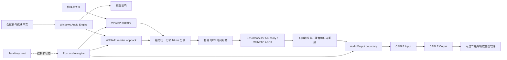

# MiniAEC 技术方案

状态：产品输出路线已从项目自有 SysVAD 驱动完全迁移到用户自行安装的 VB-CABLE。历史 M1–M4 驱动验证记录仍保留为工程证据，但不再代表当前产品依赖或发布方案。当前 OpenSpec change `adopt-vb-cable-output` 负责用户态输出实现、验证与旧驱动代码清理。

目标平台：Windows 11 x64

应用技术栈：Rust + Tauri 2（无窗口托盘）+ WASAPI + WebRTC AEC3

输出技术栈：event-driven shared-mode WASAPI render + 用户自行安装的 VB-CABLE

## 1. 产品边界

MiniAEC 只解决外放场景的声学回声：实际送往物理音响的声音经过房间和设备再次进入物理麦克风，会议对方因此听见自己的声音。

产品输入与输出固定为：

```text
物理麦克风 + 物理播放设备 loopback -> AEC -> CABLE Input -> CABLE Output
```

用户可以把 `CABLE Output` 继续交给 NVIDIA Broadcast、会议软件自带降噪或其他二级处理器。MiniAEC 本身不实现：

- 噪声抑制（NS）；
- 自动增益（AGC）；
- EQ、去混响或音色增强；
- 神经网络语音增强；
- macOS、Linux 或移动端支持；
- 设置窗口或 Web 前端。

第一个可用版本必须稳定写入用户自行安装的 `CABLE Input`，并由普通客户端持续消费 `CABLE Output`。MiniAEC 不捆绑、下载、安装、更新、卸载或授权 VB-CABLE。

## 2. 总体架构



### 2.1 Tauri 托盘宿主

Tauri 只负责进程生命周期和低频控制面。M3 当前实现包含：

- 当前状态；
- AEC 启用或显式旁路；
- 重启音频引擎；
- 从 `MINI_AEC_MICROPHONE_ID`、`MINI_AEC_RENDER_ID`、`MINI_AEC_CABLE_INPUT_ID` 和 `MINI_AEC_CABLE_OUTPUT_ID` 读取精确 endpoint ID；
- 退出。

物理设备选择界面、设置持久化、默认设备自动跟随、开机启动和打开日志目录不属于 M3。不创建 WebView 或主窗口。Tauri runtime 不处理 PCM，托盘销毁也不能意外穿透实时线程边界。

### 2.2 Rust 音频引擎

`crates/mini-aec-engine/` 负责双输入设备生命周期、预分配缓冲、10 ms 调度、有界 QPC 同步、默认 AEC、项目级输出和故障状态。它能脱离 Tauri 和具体输出实现运行合成测试。

已建立的核心边界包括：

- `AudioInput` / `AudioInputFactory`：承载显式选择且角色校验的物理 microphone capture 与 physical render loopback，Windows 类型不泄漏；
- `EchoCanceller` / `EchoCancellerFactory`：定义 render-first 处理、capture 输出与 adapter 重建，WebRTC 类型只存在于默认 M131 adapter；
- `AudioOutput` / `AudioOutputFactory`：接收完整 10 ms、48 kHz mono finite frame，具体 endpoint 格式转换和 WASAPI render 留在 Windows adapter；
- `Engine` / `EngineSnapshot`：非实时控制、只读状态、同步/AEC/队列/转换/输出时延/故障诊断。

处理 worker 独占同步器、`EchoCanceller` 和一次 output session；两个输入 worker 与 output worker 分别在自己的线程创建、使用、停止并销毁 COM/WASAPI 对象。全部 worker 使用有限等待和有界队列，停止或显式 restart 会 join 全部 worker、清空 PCM、转换、同步与 AEC 状态，并建立全新的 output session。

WebRTC、WASAPI、Tauri 和 VB-CABLE 识别细节不能泄漏到这些项目级合同之外。

当前实时 bypass 合同为：

- 配置必须提供精确的物理 capture endpoint ID 和一对精确的 VB-CABLE endpoint ID；名称只用于诊断，不能自动跟随默认设备，也不能把所选 `CABLE Output` 作为物理麦克风；
- capture worker 和 output worker 在各自线程创建、使用并销毁 WASAPI/COM 对象，output worker 独占一次 `AudioOutput` session；实时 worker 不写文件、不打印、不等待 Tauri 或 async runtime；
- WASAPI 使用 event-driven shared mode 和 Windows Audio Engine conversion 请求 48 kHz、单声道 `f32`，随后清理非有限数、限制范围并组装严格的 480-sample 帧；
- capture 到 output 之间只有四个完整帧的 latest-wins ring；满时丢弃最旧未读帧，保持 freshest-audio 行为而不增长延迟；
- 生命周期为 `Stopped → Starting → RunningBypass → Stopping → Stopped`，source invalidation、不可恢复 capture 错误、缺失或歧义的 VB-CABLE pair、output access failure 或 rejected render 会终止当前 run、清空 PCM 与转换状态并进入 `Failed`，只能显式 restart；
- snapshot 只包含 endpoint、run/session identity、packet/frame、silence、discontinuity、timestamp、queue、conversion、output 和 error 元数据，不包含 PCM 或会议内容。

历史 M2 驱动验收和后续普通用户访问验收只作为引擎有界队列、生命周期与 stale-audio 防护证据，不再定义当前输出实现。显式 bypass 仍是独立模式，不是 AEC 故障时静默泄漏原始麦克风的回退策略。

M3 实时 AEC 合同固定为：

- 配置必须同时提供精确的物理 capture endpoint ID 与物理 render endpoint ID；角色不符、inactive、不可访问或不存在均失败，不回退到默认设备；
- microphone 与 render 各使用八帧 latest-wins 同步队列；以 microphone 为处理节拍，在统一 QPC 时间线上按 5 ms 容差配对，记录 stale、silent-reference、overflow、discard、discontinuity 与 timestamp error；
- 单帧绝对偏差超过 100 ms 时 reference 视为不可用；带 render 时间戳但连续 50 个 capture 帧仍无法配对时终止当前 run。物理播放完全静音时，active loopback endpoint 合法地可能不产生 packet，此时持续使用计数静音参考并保持可见 `Degraded`，不能仅因没有 render timestamp 终止或切换 bypass；恢复十个连续健康配对帧后才回到 `RunningAec`；
- discontinuity 或 timestamp error 清空受影响的部分帧并建立新同步 epoch，同时重建 AEC；无效 AEC 输出当前帧静音并有界重建，连续三次处理失败后终止；
- 生命周期包含 `RunningAec` 与 `Degraded`，任何 AEC、同步、输入或 output 的终止错误都进入 `Failed`，不会自动切换到 `RunningBypass`；
- 处理耗时以固定桶记录 P50/P95/P99/maximum，10 ms deadline miss 与全部诊断写盘都不阻塞实时 worker。

### 2.3 Windows 音频适配

使用 WASAPI 直接访问物理 capture、render loopback、事件驱动缓冲、设备位置和 QPC 时间戳。不能用跨平台抽象隐藏 Windows 的 loopback、设备通知或时序信息。

### 2.4 AEC 适配

当前基线为 `webrtc-audio-processing 2.1.0` 和 FreeDesktop M131 源码。实时 adapter 使用 `Processor::new(48_000)`，只启用完整 AEC，使用 AEC3 上游默认参数；stream delay 不设置，NS、AGC、实验配置和后处理关闭。每个匹配的 render frame 先于 capture frame 提交，adapter 自有并复用通道缓冲，输出必须为有限值。

依赖来源和本地构建修改以 [`vendor/UPSTREAM.md`](../vendor/UPSTREAM.md) 为准。升级必须遵循 [`upstream-upgrade-plan.md`](upstream-upgrade-plan.md)。

### 2.5 VB-CABLE 输出适配器

MiniAEC 通过项目自有输出边界把完整 10 ms、48 kHz mono frame 交给 Windows 适配器。适配器按精确 endpoint ID 打开 `CABLE Input` 的 event-driven shared-mode WASAPI render stream，必要时在边界完成确定性的 channel/sample/mix-format 转换，并记录格式、padding、render、conversion、underrun、overflow、discard 与 failure metadata。

`CABLE Output` 只能作为下游录音端点，不能作为物理麦克风输入；`CABLE Input` 不能作为 AEC 的物理 render-loopback 来源。缺失、inactive、role 错误或 pair 不明确时必须失败，不能跟随 Windows 默认设备。

## 3. 音频合同

- 内部采样率：48 kHz；
- 样本格式：`f32`，有限且限制在 `[-1.0, 1.0]`；
- 处理帧：10 ms，每单声道 480 samples；
- 麦克风：首期单声道；
- render reference：按 AEC 适配器要求映射声道；
- 每个输入块携带单调时间戳、设备帧位置、序列号和 discontinuity；
- 实时路径禁止文件 I/O、控制台 I/O、无界队列、等待 Tauri runtime 和不可控堆分配。

设备 mix format 不一定是 48 kHz 或 `f32`。WASAPI 层读取真实格式，归一化层负责通道映射、重采样和 10 ms 重组。

## 4. 同步与处理顺序

1. 捕获最终送往选中物理音响的 render loopback；
2. 捕获选中的物理麦克风；
3. 转换到内部格式并建立统一 QPC 时间线；
4. 先向 AEC 提交对应 render frame；
5. 再处理 capture frame；
6. 检查非有限数和输出范围；
7. 把结果写入虚拟麦克风数据通路。

麦克风和物理播放设备可能使用独立硬件时钟。M3 只实现上节记录的有界短期对齐和终止策略；这不能证明长期稳定，也不宣称漂移校正。真机验收必须记录 timestamp delta、buffer depth、discontinuity 和长期方向，确认持续误差后再在 M4 设计小比例异步重采样，不能长期靠整帧丢弃或补零维持同步。

## 5. 故障策略

| 故障 | 行为 |
| --- | --- |
| render reference 短暂不足 | 输入静音参考，停止错误自适应并记录 underrun，不阻塞 capture |
| 麦克风数据不足 | 输出对应时长静音，不重复旧音频 |
| AEC 错误或非有限数 | 当前帧静音、进入 degraded 并重建处理器；不得静默泄漏原始回声 |
| 用户明确关闭 AEC | 使用可见的 raw microphone bypass 状态 |
| 输入或回放设备 invalidation | 当前 run 终止、清空缓冲并进入 `Failed`；只能由显式 restart 建立新流 |
| 用户态进程停止 | 关闭 render session 并清空 retained PCM，不重复最后一帧 |
| 诊断写盘过慢 | 丢诊断帧并计数，不能阻塞实时路径 |

原始麦克风旁路只能由用户明确选择，不能作为无提示的 AEC 故障降级。

## 6. 仓库结构

```text
mini-aec/
├─ Cargo.toml
├─ crates/
│  ├─ mini-aec-lab/            # 采集、离线 AEC、headless bypass 与实时默认 AEC
│  ├─ mini-aec-engine/         # 双输入同步、默认 AEC、bypass 和项目级边界
│  ├─ mini-aec-output/         # 平台无关的有界输出 session 合同
│  └─ mini-aec-windows-output/ # VB-CABLE 识别和 WASAPI render adapter
├─ src-tauri/                  # 连接 engine controller 的无窗口托盘宿主
├─ docs/
├─ vendor/
└─ testdata/              # 仅可再分发且有来源/许可证的素材
```

`artifacts/` 是被 Git 忽略的私人本地录音目录，不属于可提交项目结构。

## 7. 里程碑

M1–M4 是已完成且保留原始数字的历史 SysVAD 验证记录；它们不再描述当前产品依赖。当前产品里程碑从 M5 的 VB-CABLE 迁移开始。

### M0：仓库准备基线

- 统一 MiniAEC/mini-aec 命名；
- 删除 Web 前端与 Node/Bun 工具链；
- Tauri 改为无窗口托盘；
- 离线工具改名为 `mini-aec-lab`；
- AEC 恢复 M131 默认配置；
- 删除旧 profile、盲测和线性诊断实验入口。

完成不代表产品可用。

### 历史 M1：`MiniAEC Microphone` 数据通路 spike

- 固定 SysVAD 来源和许可证；
- 生成并安装测试签名驱动；
- Windows 中只暴露预期的公共 capture endpoint；
- 从用户态连续送入确定性测试信号；
- 用 Windows 录音工具和至少一个会议软件读取；
- 验证停止、崩溃、重启和卸载。

已完成。开发期测试签名包已经验证唯一公共 capture endpoint、固定帧传输、sender/session 隔离、录音客户端消费、重启行为和完整 rollback；该结论不等同于正式签名、installer 或普通用户权限方案已经完成。

### 历史 M2：实时 bypass 链路

- 建立 `mini-aec-engine`；
- 物理麦克风实时写入 `MiniAEC Microphone`；
- 实现设备选择、状态、显式旁路和故障恢复；
- 连续运行无爆音、旧帧重复或无界延迟。

仓库内 engine、Windows capture adapter、headless harness 和合成验证已建立；开发期 elevated 真机验收已覆盖五分钟连续录音、stop/start 隔离、sender contention、设备 restart 和完整 rollback。活动普通用户 access change 不改变 M2 音频合同，且普通运行验证不得自行改变系统；正式安装与签名仍是后续工作。

### 历史 M3：实时默认 AEC3

- 同时接入物理 render loopback；
- 10 ms QPC 对齐并运行默认 M131 AEC3；
- 托盘显示 running/degraded/bypass；
- 在真实外放、近端单讲和双讲中端到端验证。

归档 OpenSpec change `implement-realtime-default-aec` 的仓库实现、headless `realtime-aec`、托盘控制、合成自动化、Windows Recorder 与 Discord 消费、全部声学场景评估和完整 rollback 均已完成，因此本阶段的默认基线功能验收与质量表征已 accepted。Far-end-only（包括较大播放音量）、near-end-only 和 render silence/recovery 符合预期；double-talk 的明显近端吞字未达到期望质量目标，已作为默认算法限制记录，并延期到需要相同输入旧/新证据的独立 change。该阶段不包含 AEC 调参、依赖升级、长期漂移补偿、普通用户驱动权限、安装或生产签名。

### 历史 M4：漂移与稳定性

- 已实现 metadata schema v2 和 `stability-report`，用单调运行时间、两路 device-position/QPC clean segment、五分钟 rate windows、relative ppm、不确定度、同步后果和独立 functional gate 表征长时行为；
- 使用 K7 和当前活动的 Realtek speakers 进行至少 30 分钟漂移测量，普通客户端必须持续消费 `MiniAEC Microphone`，raw evidence 与 operator observations 保留在 ignored `artifacts/`；
- 只有 30 分钟结果为 `clock-drift-compensation-required` 时才另开 change 设计小比例异步重采样；`inconclusive` 只触发证据改进或重复运行；
- 30 分钟是当前 change 的最终时长 gate；只有初期版本 metadata 日志显示重复同步维护、增长的队列压力、无法解释的 discontinuity 或其他持续风险时，才由独立 change 定义更长验证时长或补偿方案；设备切换仍属于后续独立能力。

2026-08-12/13 的前两次 K7 / Realtek speakers 尝试分别暴露了旧 binary 的 final render-queue snapshot cleanup 缺陷和人工播放不足导致的 render coverage 问题。修复后使用 runtime-only 自动播放与普通 FFmpeg DirectShow client 消费完成第三次 30 分钟 run：observed duration 为 1,800.021 秒，periodic coverage 为 100%，usable duration 与最长 clean segment 均为 1,798.962 秒，无 excluded interval，并产生五个 eligible window；中位 drift 为 -2.832 ppm，MAD 为 0.149 ppm，median uncertainty 为 0.081 ppm，保守 drift 为 1.832 ppm，预计 30 分钟 phase 为 3.297 ms，因此 drift disposition 为 `bounded-synchronizer-sufficient`。双队列最终归零，driver overflow/discard、user-space overflow/discard、sink failure、invalid output、deadline miss 和 terminal error 均为零；所有 alignment/AEC recovery、单个 stale render frame 和六次新增 driver underrun 都发生在首个约 1.06 秒的启动收敛区间，之后未再增长。普通 client 与 playback process 覆盖完整 interval，用户核对录音后确认没有问题，operator sidecar 据此解释 bounded startup recovery，最终 functional disposition 为 `passed` 且 `thirty_minute_accepted` 为 true。批准的驱动 rollback 和用户手动重启后，最终只读 inventory 确认 validation device、endpoint、package、certificate、service 与服务注册表项均已移除，TESTSIGNING 为 No，K7 与 Realtek 继续分别拥有三个默认输入和输出角色。30 分钟结果完成本 change 的最终时长要求；当前证据既不支持创建 `compensate-audio-clock-drift` change，也不触发延长验证。

### M5：VB-CABLE 产品输出

- 用户从 VB-Audio 官方来源自行安装并管理受支持的 VB-CABLE 版本；MiniAEC 不捆绑或执行安装生命周期；
- 按精确 ID、data-flow role 与可核验设备 metadata 解析唯一的 `CABLE Input` / `CABLE Output` pair；
- 通过 event-driven shared-mode WASAPI 把有界、转换后的处理帧写入 `CABLE Input`；
- Windows Recorder 和至少一个目标会议应用从 `CABLE Output` 完成 bypass、默认 AEC、restart/invalidation 与 30 分钟稳定性验收；
- 等价验收通过后删除全部自有驱动、INF/SYS/CAT、签名和 release lifecycle 代码。

## 8. 验证原则

算法或同步改变必须对相同输入执行旧/新处理，至少比较：

- far-end-only 的回声残留和收敛；
- near-end-only 的音色、字首和字尾；
- double-talk 的吞音、抽吸和音量稳定性；
- 端到端延迟、CPU P50/P95/P99；
- discontinuity、underrun、overrun、reset 和恢复；
- `CABLE Output` 被下游软件实际读取时的连续性。

更高的抑制量不能覆盖近端人声损伤。调参只能在默认实时产品链路出现可复现失败后开始，并且一次改变一个机制。

## 9. 隐私与安全

- 全部音频默认本地处理；
- 默认不保存录音；
- 诊断录音必须显式开启并写入 `artifacts/`；
- 日志不包含 PCM 或会议内容；
- 输出边界使用精确 endpoint、最小必要访问与有界缓冲；
- VB-CABLE 安装、更新、卸载、许可和任何所需系统重启均由用户按官方流程在 MiniAEC 之外完成；
- 第三方源码、模型或测试素材必须记录版本、来源、许可证和 hash。

## 10. SDD 状态

仓库使用 OpenSpec 的 `spec-driven` schema 和 Codex 集成。历史 M1–M4 与普通用户驱动访问 change 已完成并归档；`production-driver-package` 和 `production-driver-lifecycle` 已作为 superseded history 归档且未把未完成的生产驱动需求同步到主规格。当前 active change 是 `adopt-vb-cable-output`。它完成前不得把 VB-CABLE 路线描述为已验收的可分发产品；任何外部驱动安装或所需 Windows restart 都只由用户手动执行。
