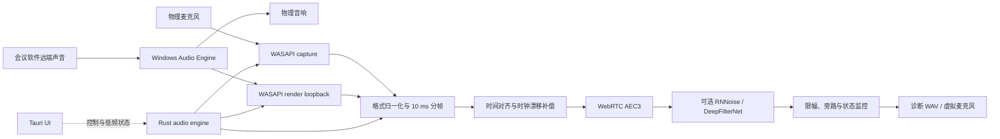
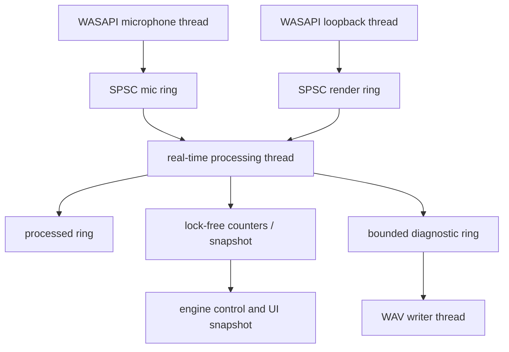

# Open Denoise 技术方案

状态：初始方案  
目标平台：Windows 11 x64 优先  
应用技术栈：Rust + Tauri 2 + React + TypeScript

## 1. 背景与目标

Open Denoise 的首要目标不是实现一个通用音频编辑器，而是解决桌面语音通话中的两个问题：

1. 音响播放的远端语音被物理麦克风再次采集，形成对方可听见的回声。
2. 麦克风中的风扇、键盘、空调等环境噪音影响通话质量。

第一优先级是声学回声消除（Acoustic Echo Cancellation，AEC），第二优先级才是单路语音降噪（Noise Suppression，NS）。产品体验以 Krisp 为对照，但初期不追求功能数量，而是先证明在目标房间、音响和麦克风组合上可以稳定消除回声。

### 1.1 成功定义

项目进入产品开发阶段前，验证程序必须证明：

- 可以同时、持续地采集物理麦克风和实际播放端点的 loopback 参考流。
- 两路音频可以根据时间戳和缓冲状态对齐并稳定送入 AEC。
- 音响单讲时回声显著降低，双讲时本地人声没有明显吞字。
- 可以保存可复现的多轨诊断录音，用同一段素材比较原始输入、AEC 输出和 Krisp 输出。
- 连续运行期间没有可闻爆音，发生设备切换或数据不足时可以安全降级。

### 1.2 首期非目标

- 首期不支持 macOS 和 Linux。
- 首期不训练自有神经网络模型。
- 首期不实现虚拟音频驱动。
- 首期不处理音乐母带、影视后期等非语音场景。
- 首期不上传或云端处理任何音频。
- 首期不以 UI 完整度作为进度指标。

## 2. 问题分类

“回声”需要区分为三类，错误分类会直接导致错误的算法路线。

| 现象                   | 原因                         | 首选处理方式                 |
| ---------------------- | ---------------------------- | ---------------------------- |
| 对方听见自己刚才说的话 | 音响声音经房间传播进入麦克风 | 带播放参考流的 AEC           |
| 风扇、键盘、空调声     | 与播放信号无关的环境噪音     | NS，放在 AEC 后              |
| 声音不断放大并出现啸叫 | 麦克风被再次送回同一播放链路 | 阻断数字回路、限幅和反馈检测 |

AEC 的关键输入是“真正送往音响的信号”。只有麦克风单路输入时，模型必须猜测哪些声音属于回声；拥有播放参考流后，AEC 才能估计扬声器、空气、房间反射和麦克风共同形成的回声路径。

## 3. 总体架构



### 3.1 组件边界

#### Tauri 控制面

负责设备选择、开关、档位、托盘、自启动、诊断状态和配置持久化。Tauri command/event 只传递控制消息和低频统计数据，禁止传递实时 PCM。

#### Rust 音频引擎

负责设备生命周期、线程、环形缓冲区、格式转换、分帧、时序、处理管线、状态机、诊断录音和故障降级。它必须可以脱离 Tauri 在命令行验证程序和测试中运行。

#### AEC 适配层

封装 WebRTC Audio Processing Module。首轮集成优先验证 `webrtc-audio-processing` Rust binding 的 `bundled` 模式；如果构建、功能暴露或版本控制不能满足要求，再替换为固定 WebRTC commit 的自有 C++/C ABI bridge。上层只依赖项目定义的 `EchoCanceller` trait。

#### Windows 音频适配层

首轮使用 `wasapi` crate 直接访问 WASAPI capture、render loopback、事件驱动缓冲和设备信息。不要用一个跨平台抽象掩盖 loopback、时间戳和设备通知等平台特性。

#### 虚拟音频驱动

产品阶段基于 Microsoft SysVAD 单独实现。驱动不是 Tauri 或 Rust 音频引擎的一部分，首轮验证不依赖它。

## 4. 音频处理链路

### 4.1 内部音频合同

- 采样率：48 kHz。
- 处理格式：`f32`，范围 `[-1.0, 1.0]`。
- 帧长：10 ms，即每通道 480 个 sample。
- 麦克风处理：首期单声道。
- 播放参考：保留原始声道信息，在进入 AEC 前按适配器要求转换。
- 所有帧携带单调时钟时间戳、设备帧位置、序列号和 discontinuity 标记。

设备原生格式可能不是 48 kHz 或 `f32`。Windows 适配层负责读取设备 mix format；格式归一化层负责通道映射和重采样，不能假设 WASAPI 每次回调正好返回 480 个 sample。

### 4.2 处理顺序

1. 获取 render loopback，形成 far-end reference。
2. 获取 microphone capture，形成 near-end input。
3. 将两路数据转换到内部格式并重组为 10 ms 帧。
4. 根据时间戳、硬件位置和环形缓冲深度估计 stream delay。
5. 先向 AEC 提交 render reverse stream，再处理相应 microphone stream。
6. 对 AEC 输出执行可选 NS。
7. 执行最终限幅、非有限数检查和故障旁路。
8. 输出到诊断录音；产品阶段再输出到虚拟麦克风。

NS 必须放在 AEC 后。先对麦克风执行强降噪会改变回声结构，可能降低自适应滤波器收敛能力。

### 4.3 延迟与时钟漂移

麦克风和音响可能来自两个独立硬件时钟。即使两者都报告 48 kHz，长时间运行后仍可能逐渐错位。引擎需要同时处理：

- WASAPI capture/render 软件缓冲延迟。
- 音响 DAC、功放和空气传播延迟。
- 麦克风 ADC 与驱动缓冲延迟。
- 不同设备时钟产生的持续 drift。
- 蓝牙、USB、HDMI 切换带来的突发延迟变化。

第一版先记录并暴露缓冲深度、时间戳差值和 discontinuity。确认实际漂移后，再加入小比例异步重采样控制器；不能通过不断丢整帧或补整帧长期维持同步。

### 4.4 故障降级

| 故障                      | 行为                                                                |
| ------------------------- | ------------------------------------------------------------------- |
| render reference 暂时不足 | 暂停 AEC 自适应或按库合同输入静音参考，不阻塞麦克风                 |
| 麦克风数据不足            | 输出静音并记录 underrun，不重复旧帧                                 |
| AEC 返回错误或非有限数    | 切换到原始麦克风旁路并标记 degraded                                 |
| 默认设备变化              | 停止旧流、刷新缓冲、重建流并重置 AEC                                |
| UI 退出                   | 音频引擎按产品模式决定退出或留在托盘，不由 WebView 意外销毁实时线程 |
| 诊断磁盘写入过慢          | 丢弃诊断帧并计数，不能阻塞音频线程                                  |

## 5. 算法路线

### 5.1 AEC 基线

采用 WebRTC AEC3，而不是从 NLMS 自适应滤波器开始自行实现。WebRTC APM 原生以 near-end `ProcessStream` 和 far-end `ProcessReverseStream` 工作，并以 10 ms PCM 帧作为处理单位。

首轮只使用稳定的高层配置：

- Echo Canceller 3：开启。
- High-pass filter：根据实际 API 和听感验证决定。
- Noise suppression：先关闭，以隔离 AEC 效果。
- Gain control：先关闭，避免对比录音音量被自动改变。

AEC3 详细参数只有在基线数据证明默认参数不足时才调整。实验参数、依赖版本和录音场景必须一起记录。

当前 AEC3 上游版本、来源链和本地补丁以
[`vendor/UPSTREAM.md`](../vendor/UPSTREAM.md) 为准。WebRTC 不是滚动依赖；任何版本更新必须遵循
[`docs/upstream-upgrade-plan.md`](upstream-upgrade-plan.md)，使用相同输入完成旧版/候选版回归后才能替换基线。

### 5.2 普通降噪

在 AEC 基线通过后按以下顺序比较：

1. WebRTC 自带 NS：依赖最少，适合作为基准。
2. RNNoise：轻量、48 kHz、适合低延迟模式。
3. DeepFilterNet：作为高质量模式候选，需要单独测量 CPU、模型体积和算法延迟。

首期不把 DeepFilterNet 的效果假设成既定结论。所有算法必须使用同一批多轨录音进行盲听和指标比较。

### 5.3 自有模型的触发条件

只有同时满足以下条件才考虑训练自有 residual echo 模型：

- 已经验证参考流正确、延迟稳定且 AEC3 正常收敛。
- 已定位剩余问题主要来自非线性音响失真、长混响或极端双讲，而不是工程链路错误。
- 已积累经授权的 far-end、near-end clean、mic mixture 和 room impulse response 数据。
- 有可重复的训练、离线评估和实时推理基线。

## 6. 实时线程模型

建议至少拆分为以下执行单元：



实时路径禁止：

- 堆分配与容器扩容。
- 文件、网络和控制台 I/O。
- 无界 channel。
- 等待 mutex 或 Tauri runtime。
- 模型加载、设备枚举和配置序列化。
- panic 穿过音频线程边界。

所有缓冲区在启动阶段分配。状态变更通过原子变量、预分配消息槽或有界无锁队列传入。第一阶段可以先实现正确、可观察的有界队列，再根据 profiler 结果优化。

## 7. 代码组织

计划演进为 Cargo workspace：

```text
open-denoise/
├─ Cargo.toml
├─ crates/
│  ├─ denoise-core/          # 帧、配置、状态机、处理 trait
│  ├─ denoise-audio-windows/ # WASAPI capture 与 render loopback
│  ├─ denoise-aec-webrtc/    # WebRTC APM/AEC3 适配
│  ├─ denoise-engine/        # 实时编排、ring buffer、故障降级
│  └─ denoise-lab/           # CLI、诊断录音和离线处理
├─ src-tauri/                # Tauri 桌面壳与控制命令
├─ src/                      # React UI
├─ driver/windows/           # 产品阶段的 SysVAD 派生驱动
├─ docs/
└─ testdata/                 # 仅可再分发的合成或公开测试素材
```

核心接口方向：

```rust
pub trait EchoCanceller {
  fn reset(&mut self, config: StreamConfig) -> Result<(), AudioError>;
  fn analyze_render(&mut self, frame: &AudioFrame) -> Result<(), AudioError>;
  fn process_capture(
    &mut self,
    frame: &mut AudioFrame,
    stream_delay: Duration,
  ) -> Result<ProcessStats, AudioError>;
}
```

实际 API 可以在 spike 后调整，但必须保留“核心逻辑不依赖 Tauri”和“AEC 实现可替换”两个边界。

## 8. 诊断录音与可复现性

每次验证运行生成一个独立目录：

```text
artifacts/runs/<timestamp>/
├─ manifest.json
├─ microphone.wav
├─ render-reference.wav
├─ aec-output.wav
├─ processed-output.wav
└─ events.jsonl
```

`manifest.json` 至少记录：

- Git commit。
- Windows 版本与进程架构。
- 输入、输出设备 ID 和友好名称。
- 设备 mix format 与内部 format。
- AEC/NS 实现、版本、配置和模型 hash。
- 启动、停止时间和运行原因。
- 用户明确提供的场景标签，例如设备距离、音量和房间。

`events.jsonl` 记录设备变化、discontinuity、underrun、overrun、AEC reset、buffer depth 和估计 delay。默认不提交 `artifacts/`，录音只能在用户主动开启诊断时保存。

## 9. 验证矩阵

### 9.1 必测声学场景

1. 只有音响播放远端语音，本地不说话。
2. 只有本地说话，音响静音。
3. 双方同时说话。
4. 音响音量从低到高逐级变化。
5. 播放内容从语音切换到音乐和瞬态提示音。
6. 本地敲键盘、风扇持续运行。
7. 运行中移动麦克风或改变音响方向。
8. 运行中切换默认麦克风或输出设备。
9. USB、板载、HDMI 和蓝牙设备按实际拥有的硬件覆盖。

### 9.2 初始工程门槛

以下是早期 gate，不是最终商业承诺：

- 48 kHz 连续运行 2 小时，无崩溃和可闻周期性爆音。
- 音频处理线程 P99 小于一个 10 ms block 预算的 30%。
- 不启用高质量 NS 时，新增处理延迟目标不超过 30 ms。
- 固定声学路径下，1 至 2 秒内听感上明显收敛。
- 单讲场景以 ERLE 超过 20 dB 作为起始目标，同时进行盲听确认。
- 双讲场景不出现持续吞音、强烈金属音或音节末尾被切断。
- 设备切换后可以自动恢复，失败时提供明确状态和旁路。

### 9.3 指标

- AEC：ERLE、收敛时间、残余回声听感、double-talk 保真度。
- 语音质量：DNSMOS、STOI/PESQ（仅在数据合同适用时）、盲听评分。
- 系统：CPU、内存、处理 P50/P95/P99、underrun/overrun、buffer depth。
- 产品：设备恢复成功率、启动时间、故障旁路时间。

单一客观指标不能代替听感。尤其在双讲场景中，追求更高抑制量可能同时损伤本地语音。

## 10. 虚拟麦克风产品化

验证通过后，Windows 产品需要暴露 `Open Denoise Microphone` capture endpoint，让会议软件直接选择处理后的声音。

计划：

1. 从 Microsoft SysVAD 派生最小虚拟 capture endpoint。
2. 用户态 Rust 服务将处理后的 PCM 写入共享缓冲。
3. 驱动消费缓冲并向 Windows Audio Engine 提供 capture stream。
4. 服务失联时输出静音或按明确策略旁路，不能重复旧音频。
5. 安装包负责管理员权限、驱动签名、升级和卸载。

驱动开发使用 WDK 支持的 C/C++。测试签名只用于开发机；发行版本需要正式签名并评估 HLK。SysVAD 是架构起点，不是可以直接发布的成品驱动。

输出降噪属于另一条链路：会议软件将远端声音送入虚拟 render endpoint，用户态程序处理后再播放到物理音响。只有在虚拟麦克风和 AEC 已经稳定后才实现，且 AEC reference 必须取“最终实际送往物理音响”的处理后信号。

## 11. 隐私与安全

- 默认完全本地处理。
- 默认不录音；诊断录音必须由用户显式开启。
- UI 明确显示录音状态和输出目录。
- 日志不得包含 PCM、设备外的个人内容或会议元数据。
- 崩溃报告默认只包含结构化运行指标，上传前需用户同意。
- Tauri capability 使用最小权限，不为音频功能开放无关 shell、文件或网络权限。
- 第三方模型和数据在引入前记录许可证、来源和 hash。

## 12. 里程碑与提交策略

### M0：干净应用基线

- Tauri 2 + Rust + React 可以构建。
- 移除模板示例和无关权限。
- 格式化、lint 和构建命令可重复执行。

### M1：双路采集诊断程序

- 建立 Cargo workspace 和独立 `denoise-lab` CLI。
- 枚举 WASAPI capture/render 设备。
- 同时采集麦克风与 render loopback。
- 写出对齐前的两路 WAV 和事件清单。

完成标准：真实播放期间两轨持续有数据、格式正确、无明显断裂，并可以测出两路时间关系。

### M2：AEC3 离线与实时基线

- 先用已录制双轨完成可重复离线 AEC。
- 再接入实时 10 ms 管线。
- 输出 `aec-output.wav` 和 AEC 状态。
- 完成单讲、近端单讲和双讲对比。

### M3：同步与稳定性

- 补齐 stream delay 估计。
- 根据长时间数据实现 drift compensation。
- 完成设备切换、故障旁路和 2 小时稳定性测试。

### M4：噪声抑制比较

- 比较 WebRTC NS、RNNoise 和 DeepFilterNet。
- 决定低延迟与高质量模式。
- 固化测试素材、指标脚本和模型许可证记录。

### M5：虚拟麦克风

- 完成 SysVAD spike、用户态通信、签名与安装流程。
- 在主流会议软件中完成兼容性测试。

每个里程碑保持小提交：结构、采集、文件格式、AEC、同步和 UI 分开提交。涉及算法效果的提交必须附上可复现运行命令和对应 manifest，不提交私人录音。

## 13. 当前最值得先做的验证

M1 双路 WASAPI 采集与 M2 离线 QPC 对齐/AEC3 基线已经完成。far-end-only 与受控双讲
录音证明参考流可用、AEC3 能收敛，并能完整删除视频人声；结果见
[`docs/aec-baseline.md`](aec-baseline.md)。当前未通过项是双讲时的本地吞字、抽吸和音量
波动。

第一轮匿名 A/B/C 已排除“更早进入并长时间保持近端状态”的方向。第二轮拆分变量后，
`recovery-fast` 主观上优于 `drop-smooth` 和默认配置；但第三轮继续比较 near-end
`max_inc_factor = 2 / 4 / 8` 时，三者差异小到无法可靠分辨。因此停止继续沿单一参数盲调，
冻结默认配置。

线性/完整输出的机制隔离已经完成。线性版本明显更能保留近端说话声和字尾，证明线性滤波与
时间对齐不是吞字主因；但它放回了非常清楚、不可用的视频人声，音质也明显较差。因此 residual
echo suppressor 是近端损伤的主要来源，同时又不能被直接旁路或固定混合。

当前最高价值验证是使用 M131 已有的 more-transparent near-end suppressor 参数，分别只放宽
低频和高频 masking threshold，与默认配置做匿名 A/B/C。普通 far-end tuning 保持不变；先用
远端单讲区间筛除回声明显回退的候选，再以双讲盲听判断字尾、抽吸、音量稳定性和视频人声
返回。如果两个频段候选仍吞字，下一步应观测 near-end detector 状态，而不是继续盲调 gain。

双讲通过后，录制至少 30 分钟，测量 K7 与 Sound Blaster X4 的时钟漂移、延迟变化和
discontinuity，再决定异步重采样控制器的设计。完成这两项后才进入实时 10 ms 管线；此时
仍不引入独立 NS、AGC、虚拟驱动或 WebRTC 上游升级，以保持变量隔离。

## 14. 主要风险与应对

| 风险                                 | 影响                | 应对                                           |
| ------------------------------------ | ------------------- | ---------------------------------------------- |
| loopback 与麦克风时钟漂移            | AEC 长时间后失效    | 记录设备位置和缓冲深度，加入异步重采样         |
| WebRTC binding 在 Windows 构建不稳定 | 阻塞 AEC 集成       | 保持 trait 边界，必要时维护固定版本 C++ bridge |
| 蓝牙 profile 和设备切换              | 格式、延迟突变      | 明确状态机，重建流并重置 AEC                   |
| 强非线性音响失真                     | 线性 AEC 后残余明显 | 先验证链路，再评估 residual echo 模型          |
| 强抑制损伤双讲语音                   | 产品不可用          | 单讲与双讲分别 gate，保留强度档位和旁路        |
| 虚拟驱动签名与兼容性                 | 发行周期变长        | 驱动延后到算法验证后，单独里程碑管理           |
| 诊断录音泄露隐私                     | 严重隐私风险        | 默认关闭、显式提示、本地保存、禁止自动提交     |

## 15. 参考资料

- [WebRTC Audio Processing API](https://webrtc.googlesource.com/src/+/refs/heads/main/api/audio/audio_processing.h)
- [WebRTC AEC3 source](https://webrtc.googlesource.com/src/+/refs/heads/main/modules/audio_processing/aec3/)
- [Rust webrtc-audio-processing binding](https://github.com/tonarino/webrtc-audio-processing)
- [Microsoft WASAPI loopback recording](https://learn.microsoft.com/en-us/windows/win32/coreaudio/loopback-recording)
- [Rust wasapi crate](https://docs.rs/wasapi/latest/wasapi/)
- [Microsoft SysVAD sample](https://learn.microsoft.com/en-us/samples/microsoft/windows-driver-samples/sysvad-virtual-audio-device-driver-sample/)
- [RNNoise](https://github.com/xiph/rnnoise)
- [DeepFilterNet](https://github.com/Rikorose/DeepFilterNet)
- [Tauri architecture](https://v2.tauri.app/concept/architecture/)
