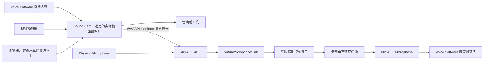

## Context

MiniAEC 目前已经有离线 AEC 验证代码和无窗口 Tauri 托盘壳，但尚无 Windows 虚拟音频驱动或实时输出边界。完整产品中，`Sound Card` 代表用户选择的实际系统输出设备，它承载 Windows 混合后的全部播放内容，不只包含 `Voice Software`，还包含视频播放器、浏览器、游戏和其他应用。MiniAEC 将同时采集 `Physical Microphone` 与 `Sound Card` 的 WASAPI loopback，把后者作为 AEC 远端参考，再把处理后的 PCM 送入唯一公开的 `MiniAEC Microphone` 供 `Voice Software` 选择。

本变更只建立图中 `VirtualMicrophoneSink` 之后的确定性用户态 PCM 到 `MiniAEC Microphone` 数据通路，使后续实时引擎可以依赖一个项目自有且可替换的虚拟麦克风 transport，而不把 SysVAD、IOCTL 或控制设备类型泄漏到音频引擎接口之外。`Physical Microphone`、`Sound Card` loopback 和实时 AEC 仍明确留在后续变更中。

Microsoft SysVAD 是 WDM/WaveRT 虚拟音频驱动样例，不直接提供 MiniAEC 所需的用户态 PCM 注入协议。驱动原型同时涉及内核安全、实时欠载、设备生命周期、测试签名和会改变本机状态的部署验证，因此需要先形成独立的可回滚验证切片。

## Goals / Non-Goals

**Goals:**

- 固定并追踪唯一的 Microsoft SysVAD 上游、许可证和本地差异。
- 建立受限驱动控制接口、驱动自有有界环形缓冲、最小确定性 PCM 发送端和公开采集端点。
- 只暴露一个公开的 `MiniAEC Microphone`，不创建生产者专用的公开或隐藏音频端点。
- 让 `MiniAEC Microphone` 作为正常的输入端点出现在 Windows 系统声音设置中，并允许用户把它选为默认输入设备。
- 定义连续采集、发送端消失与恢复、驱动重启和卸载后的确定性行为。
- 把所有系统级动作限制在明确批准的本机开发验证流程中。

**Non-Goals:**

- 不建立物理麦克风、render loopback、AEC3 或托盘到驱动的数据链路。
- 不承诺生产级低延迟、功耗、多会话仲裁、自动更新、正式签名、HLK 认证或安装器体验。
- 不修改 SysVAD 之外的 WebRTC/AEC 依赖，也不使用私有录音作为测试输入。

## Decisions

### 1. 固定单一 SysVAD 上游

唯一上游为 `https://github.com/microsoft/Windows-driver-samples` 的 `audio/sysvad`，固定 commit `2ee527bfeb0aeb6be11f0a8b6dce4011b358ce89`，许可证为 Microsoft Public License（MS-PL）。实现时必须在 `driver/windows/UPSTREAM.md` 记录仓库、目录、commit、获取日期、许可证文件、导入文件清单、构建工具版本和每一项本地修改；仓库中必须保留许可证与通知要求所需的文本。

`microsoft/audio` 中的 SysVAD 副本不作为第二上游，也不参与自动同步。这样可以避免两个官方副本产生不明确的合并基线；未来升级必须是单独的显式变更。

### 2. 采用受限驱动控制接口，不创建私有 WaveRT render sink

验证驱动只公开一个 capture 端点 `MiniAEC Microphone`。用户态发送程序通过带访问控制的私有驱动接口提交 PCM；该接口不是 WASAPI render 或 capture 端点，不参与普通音频设备枚举，也不依赖隐藏端点或 `NeverSetAsDefault` 一类只能限制默认选择、不能保证不可见的属性。公开 capture 端点不得设置 `PKEY_AudioDevice_NeverSetAsDefaultEndpoint`，必须作为正常的默认输入候选出现在 Windows 系统声音设置中，并允许用户把它选为默认输入设备。

验证生命周期不调用端点策略接口主动强制切换默认输入，但接受 Windows 在安装新活动 capture 端点时依据系统启发式自动改变一个或多个默认输入角色。安装前后必须记录各输入角色的默认端点；这种已记录的自动变化不构成安装失败，但卸载与回滚必须核对并恢复安装前的默认设备基线。

私有 WaveRT render sink 在设计阶段被排除。可供 WASAPI 正常打开的活动 render 端点会进入 Windows 音频端点模型，难以同时满足“可用”和“普通应用不可枚举”；为隐藏而依赖未知端点状态或定制枚举行为会增加脆弱性。全局命名共享内存也被排除，因为它会把驱动缓冲映射和索引完整性暴露给用户态。受限控制接口虽然需要项目自定义协议和流控，但能直接满足单一公开端点、安全复制、固定格式和确定恢复语义。

验证阶段控制接口的设备访问控制列表只允许 SYSTEM 和 Administrators。生产版本的服务身份、最小权限账户和安装器访问控制留给后续变更，本原型不得把接口开放给任意本地进程。

### 3. 使用固定、可验证的单发送会话协议

`VirtualMicrophoneSink::open` 建立一个发送会话，驱动同一时间只允许一个活动发送会话。协议头包含固定标识、协议版本、头长度、总长度、会话身份、单调帧序号、PCM payload 长度和保留字段；首版每次写入必须恰好携带一个 10 ms 帧，即 48 kHz 单声道 PCM16 的 480 个采样和 960 字节 payload。驱动在复制前验证版本、所有长度、会话身份和帧序号，不支持的版本、部分帧、越界长度、旧会话或非单调序号整次拒绝。

控制句柄关闭或发送进程退出时，驱动结束该会话；新的合法会话开始时原子清空旧会话未消费帧并重置会话级序号状态。第二个发送者在已有活动会话时被拒绝，不能抢占、拼接或改变当前会话。驱动只把验证后的 PCM 复制到自身内存，不把环形缓冲地址或索引映射给用户态。

### 4. 使用项目自有 transport 边界

用户态最小发送程序只依赖项目定义的 `VirtualMicrophoneSink` 语义：协商固定格式、写入带单调帧序号的 PCM、报告写入失败和显式关闭。控制设备标识、IOCTL 协议和 SysVAD 类型只存在于 Windows adapter 中，未来实时 AEC 引擎可以替换测试信号而无需感知驱动实现。

测试发送程序生成可审计的合成信号，不读取物理麦克风或 `artifacts/`。信号包含稳定基音、周期性可识别标记和单调帧序号对应的日志，以便把 Windows 录音结果与发送端时间线对齐。

### 5. 以音频时钟消费 10 帧驱动自有环形缓冲

公开端点名固定为 `MiniAEC Microphone`，原型格式固定为 48 kHz 单声道 PCM16。驱动在非分页内存中拥有容量为 10 个完整帧的环形缓冲，共 4,800 个采样、9,600 字节和 100 ms 最大音频容量；控制接口生产路径与 capture 消费路径通过驱动内部同步访问它，任何一侧都不能观察或发布部分帧。容量是应对短时调度抖动的上限，不是启动门槛，capture 收到首帧后无需等待缓冲填满。

驱动 capture 路径按 WaveRT/音频时钟每 10 ms 消费一个完整帧，不能由用户态写入节奏直接驱动。发送端未连接或数据欠载时，capture 输出零值静音且时间线继续推进，不能重复旧音频；每次欠载增加计数。缓冲已满而新帧通过验证时，驱动丢弃最旧的一个未消费完整帧、接受最新帧，并增加 overflow 与 discarded-frame 计数，以有界的不连续换取实时性，避免持续播放过期语音。诊断同时记录当前深度和历史高水位，便于后续用数据决定是否缩小容量。

### 6. 把恢复边界分为发送端、驱动和录音客户端

发送程序退出时，已经打开的 Windows 录音流应继续收到静音；发送程序重启后同一录音流应恢复收到新会话信号。驱动被禁用、启用或重启时，现有录音流可以失败并由 Windows 录音工具重新打开，但端点重新出现后必须再次可采集。卸载后 `MiniAEC Microphone`、控制接口、驱动服务和临时驱动包不得残留，其他物理音频设备不得被改变。

### 7. 测试签名只用于明确批准的开发机操作

构建产生 x64 Debug 驱动包、目录文件和本地测试证书签名结果。证书私钥、生成的驱动包和机器特定部署产物不提交到仓库。启用 Windows 测试签名、安装、禁用/启用设备、重启驱动和卸载都必须在执行前得到用户明确批准；脚本默认只检查前置条件或打印将执行的命令，不静默修改启动配置、证书存储或设备状态。

开发验证记录必须包含 Windows、Visual Studio、SDK、WDK、Secure Boot/测试模式状态和实际执行命令。正式签名、服务化权限模型和生产安装器作为后续变更处理。

## Risks / Trade-offs

- [私有控制接口扩大内核攻击面] → 使用固定大小、版本化、严格校验的复制协议，把原型接口限制到 SYSTEM/Administrators，并对所有长度、会话、序号和句柄清理路径做边界检查。
- [10 帧容量掩盖持续调度问题] → 正常消费不等待缓冲填满，同时记录当前深度、高水位、欠载、溢出和丢弃计数；实时引擎接入后根据实测调整容量，而不是把 100 ms 当作目标积压。
- [溢出时丢弃最旧帧造成短暂语音跳变] → 只丢弃完整帧并计数，以一次有界不连续换取恢复到最新实时语音；验收要求正常五分钟运行不得出现无法解释的溢出。
- [测试签名或驱动部署影响开发机启动和音频设备] → 所有变更动作需明确批准，先保存基线设备清单，提供逐步卸载与恢复检查，不自动更改 Secure Boot。
- [Windows 安装启发式可能把新端点设为默认输入] → 安装前后记录各输入角色的默认端点，接受已记录的自动切换，不由验证脚本主动强制切换；卸载后核对原基线，未自动恢复时只在用户明确批准下恢复原默认输入。
- [Windows 录音工具的编码隐藏样本级问题] → 同时保留发送端序号日志和驱动诊断计数器，用录音结果验证可听标记与持续时间，用计数器验证欠载、溢出和会话切换。
- [五分钟通过不能证明生产稳定性] → 本变更只证明最小通路；长时间漂移、压力、并发客户端和性能门槛留给实时引擎接入后的独立验证。
- [固定上游会错过安全或 WDK 修复] → 不跟随 `main` 自动更新；任何升级单独审查 release/commit 差异、许可证、构建结果和本地 patch。

## Migration / Rollback Plan

1. 在不安装驱动的情况下导入并构建固定 SysVAD 基线，记录可复现工具链和上游清单。
2. 在不安装驱动的情况下实现受限控制接口、固定帧协议、10 帧驱动自有环形缓冲和 `VirtualMicrophoneSink` adapter，并通过非系统级协议与边界测试。
3. 构建唯一的 x64 Debug 测试签名验证包，确认它只声明一个公开 capture 端点且生成物与证书私钥不进入版本控制。
4. 经用户明确批准后，在开发机安装测试签名包，保存安装前设备与各输入角色的默认端点基线，验证 `MiniAEC Microphone` 可在 Windows 系统声音设置中被选为默认输入，记录 Windows 是否自动改变默认输入，并执行连续采集、发送端重启和驱动重启验收。
5. 回滚时先停止发送程序，再卸载测试设备和驱动包、移除仅为本次验证添加的测试证书和控制接口，并与设备及默认端点基线比较；若 Windows 未自动恢复原默认输入，只在用户明确批准下按记录恢复，启动配置如有改变也只按记录的原值恢复且需要再次确认。

## Open Questions

- 本变更没有阻塞实现的 transport 选型问题；受限控制接口和 10 帧驱动自有环形缓冲是当前唯一验证路径。
- 生产服务身份、正式签名、安装器访问控制，以及实时引擎接入后是否缩小缓冲容量，必须依据后续变更和实测处理，不在本原型中提前决定。
